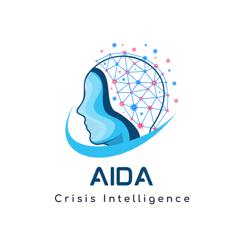
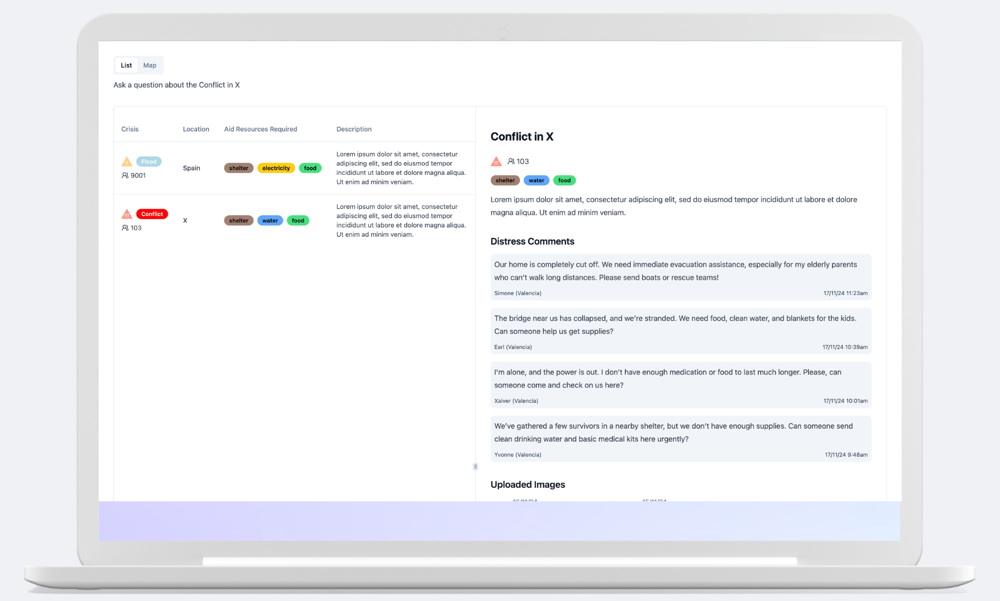

<div align="center">



</div>

## Description

AIDA is a crisis intelligence platform that uses LLMs to quickly detect disasters, collect data to help further understand the nature of the challenge, extract actionable insights and empower humanitarian organisations to respond effectively.

## Model Capabilities

The main model used in Aida is Llama 3.2. It is a 11B model that is able to understand satellite, drone and ground images and detect accurately whether there is a natural disaster happening.

It is being used to perform the following tasks

- Detect the presence of a disaster in before and after satellite images of a region
- Extract the aid resources required by victims of a disaster
- Describe images of a disaster
- Describe the current state of a disaster in real-time using commentary and images

These features make it possible to achieve the powerful features of the AIDA platform.




### Run in containers

-   Clone the repo and navigate to the root folder.

-   To run the app using Docker, make sure you've got [Docker](https://www.docker.com/) installed on your
    system. From the project's root directory, run:

    ```sh
    make run-container
    ```

### Or, run locally

If you want to run the app locally, without using Docker, then:

-   Clone the repo and navigate to the root folder.

-   Install [uv](uv) for dependency management.

-   Start the app. Run:

    ```sh
    make run-local
    ```

    This will set up a virtual environment `.venv` in the current directory with Python
    3.11, install dependencies, and start the Uvicorn server.


## The Team

- Priya Prakash
- Nitish Mital
- Nihir
- Habeeb Shopeju


<div align="center">
✨ 🍰 ✨
</div>
